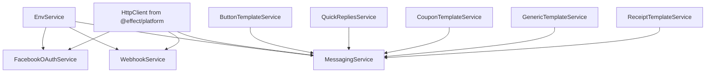

# Design Document: NestJS to Effect Services Migration

## Overview

This design outlines the architecture and implementation strategy for migrating the receptionist application's service layer from NestJS dependency injection to Effect-TS services. The migration will transform approximately 15 services into composable, type-safe Effect services with explicit error handling and declarative dependency management.

### Goals

1. Replace NestJS `@Injectable()` services with Effect `Effect.Service` classes
2. Convert constructor-based dependency injection to Layer-based composition
3. Transform Promise-based APIs to Effect-based APIs with typed error channels
4. Maintain backward compatibility during gradual migration
5. Improve testability through Effect's dependency injection system

### Non-Goals

- Migrating NestJS controllers (they will remain as execution boundaries)
- Changing the external API contracts of services
- Modifying the database schema or data models
- Rewriting business logic (only changing the service wrapper)

## Architecture

### Service Layer Structure

```
apps/receptionist/src/
├── service/
│   ├── effect/                    # New Effect services
│   │   ├── env.service.ts         # Environment configuration
│   │   └── facebook/              # Facebook Graph API services
│   │       ├── messaging.service.ts
│   │       ├── button-template.service.ts
│   │       ├── quick-replies.service.ts
│   │       ├── webhook.service.ts
│   │       └── ...
│   ├── errors/                    # Typed error definitions
│   │   ├── config.errors.ts
│   │   └── facebook.errors.ts
│   └── layers/                    # Layer compositions
│       ├── app.layer.ts           # Main application layer
│       └── test.layer.ts          # Test layer with mocks
```

**Note:** We use `@effect/platform`'s HttpClient directly, so no custom HTTP service wrapper is needed.

### Dependency Graph



## Components and Interfaces

### 1. Core Services

#### EnvService (Effect)

```typescript
import { Effect, Data, Layer } from "effect";
import { parseEnv, z, port } from "znv";

// Error types
class ConfigError extends Data.TaggedError("ConfigError")<{
  readonly message: string;
  readonly cause?: unknown;
}> {}

// Service definition
class EnvService extends Effect.Service<EnvService>()("app/EnvService", {
  effect: Effect.gen(function* () {
    const config = yield* Effect.try({
      try: () => parseEnv(process.env, envSchema),
      catch: (error) => new ConfigError({ 
        message: "Failed to parse environment variables",
        cause: error 
      }),
    });

    return {
      getDatabaseUrl: () => Effect.succeed(config.DATABASE_URL),
      getPort: () => Effect.succeed(config.PORT),
      getCookieSecret: () => Effect.succeed(config.COOKIE_SECRET),
      getGeminiApiKey: () => Effect.succeed(config.GEMINI_API_KEY),
      getMessengerVerifyToken: () => Effect.succeed(config.MESSENGER_VERIFY_TOKEN),
      getMessengerAppSecret: () => Effect.succeed(config.MESSENGER_APP_SECRET),
      getUserAccessToken: () => Effect.succeed(config.USER_ACCESS_TOKEN),
      getChatBotAppId: () => Effect.succeed(config.CHAT_BOT_APP_ID),
      getChatBotAppSecret: () => Effect.succeed(config.CHAT_BOT_APP_SECRET),
      getChatBotAppAccessToken: () => Effect.succeed(config.CHAT_BOT_APP_ACCESS_TOKEN),
    } as const;
  }),
}) {}
```

#### HttpService (Effect Platform)

Effect provides a built-in HTTP client via `@effect/platform`. We'll use it directly rather than wrapping Axios.

```typescript
import { HttpClient, HttpClientRequest, HttpClientResponse } from "@effect/platform";
import { Effect, Data } from "effect";

// Error types are already provided by Effect's HTTP client:
// - HttpClientError.RequestError
// - HttpClientError.ResponseError
// We can add custom errors if needed

class FacebookApiError extends Data.TaggedError("FacebookApiError")<{
  readonly status: number;
  readonly message: string;
  readonly fbtraceId?: string;
}> {}

// Usage example in services:
// The HttpClient service is provided by Effect Platform
// Services inject it via yield* in the effect implementation

// Example usage:
const makeRequest = Effect.gen(function* () {
  const client = yield* HttpClient.HttpClient;
  
  const request = HttpClientRequest.get("https://graph.facebook.com/me");
  const response = yield* client.execute(request);
  const data = yield* HttpClientResponse.json(response);
  
  return data;
});
```

**Key Benefits of Effect's HttpClient:**
- Built-in error handling with typed errors
- Automatic retries and timeouts
- Request/response interceptors
- Schema validation integration
- No need for custom error mapping from Axios
```

#### Dependency Management Pattern

**IMPORTANT: Do NOT use the `dependencies` array in Effect.Service definitions**

When defining Effect services, avoid using the `dependencies` configuration option. Instead:

1. **Inject dependencies via `yield*`** in the effect implementation
2. **Provide dependencies via `Layer.provide`** when creating the service layer
3. **Export a "Live" layer** for production use with all dependencies configured

**Why this pattern?**
- **Better testability**: Tests can easily provide mock implementations without fighting baked-in layers
- **Explicit dependency management**: Dependencies are visible where they're provided, not hidden in the service definition
- **Flexibility**: Different environments (test, dev, prod) can provide different implementations

**Example:**

```typescript
// ❌ DON'T: Using dependencies array (hard to test)
export class MyService extends Effect.Service<MyService>()("app/MyService", {
  effect: Effect.gen(function* () {
    const httpClient = yield* HttpClient.HttpClient;
    // ... implementation
  }),
  dependencies: [FetchHttpClient.layer, EnvService.Default], // Hard to override in tests!
}) {}

// ✅ DO: No dependencies array, provide via layers
export class MyService extends Effect.Service<MyService>()("app/MyService", {
  effect: Effect.gen(function* () {
    const httpClient = yield* HttpClient.HttpClient;
    const envService = yield* EnvService;
    // ... implementation
  }),
}) {}

// Export a live layer for production
export const MyServiceLive = MyService.Default.pipe(
  Layer.provide(
    Layer.mergeAll(
      FetchHttpClient.layer,
      EnvService.Default
    )
  )
);

// In tests, easily provide mocks
const TestLayer = MyService.Default.pipe(
  Layer.provide(
    Layer.mergeAll(
      MockHttpClient,  // Easy to mock!
      MockEnvService
    )
  )
);
```

### 2. Facebook Graph API Services

#### ButtonTemplateService (Effect)

```typescript
import { Effect, Data } from "effect";

// Error types
class ValidationError extends Data.TaggedError("ValidationError")<{
  readonly field: string;
  readonly message: string;
}> {}

// Service definition
class ButtonTemplateService extends Effect.Service<ButtonTemplateService>()(
  "app/ButtonTemplateService",
  {
    effect: Effect.succeed({
      createWebUrlButton: (
        title: string,
        url: string,
        options?: {
          webview_height_ratio?: "compact" | "tall" | "full";
          messenger_extensions?: boolean;
          fallback_url?: string;
          webview_share_button?: "hide";
        }
      ) =>
        Effect.gen(function* () {
          // Pattern matching with validation
          // Note: Effect.gen automatically wraps the return value in Effect
          return yield* Match.value(title.length).pipe(
            Match.when((len) => len > 20, () =>
              Effect.fail(
                new ValidationError({
                  field: "title",
                  message: "Button title must be 20 characters or less",
                })
              )
            ),
            Match.orElse(() =>
              // Return plain value - Effect.gen will wrap it
              Effect.succeed({
                type: "web_url" as const,
                title,
                url,
                ...options,
              })
            )
          );
        }),

      createPostbackButton: (title: string, payload: string) =>
        Effect.gen(function* () {
          return yield* Match.value(title.length).pipe(
            Match.when((len) => len > 20, () =>
              Effect.fail(
                new ValidationError({
                  field: "title",
                  message: "Button title must be 20 characters or less",
                })
              )
            ),
            Match.orElse(() =>
              Effect.succeed({
                type: "postback" as const,
                title,
                payload,
              })
            )
          );
        }),

      createButtonTemplatePayload: (text: string, buttons: Button[]) =>
        Effect.gen(function* () {
          return yield* Match.value(buttons.length).pipe(
            Match.when((len) => len < 1 || len > 3, () =>
              Effect.fail(
                new ValidationError({
                  field: "buttons",
                  message: "Button template must have 1-3 buttons",
                })
              )
            ),
            Match.orElse(() =>
              Effect.succeed({
                template_type: "button" as const,
                text,
                buttons,
              })
            )
          );
        }),
    } as const),
  }
) {}
```

#### MessagingService (Effect)

```typescript
import { HttpClient, HttpClientRequest, HttpClientResponse } from "@effect/platform";
import { Effect, Data } from "effect";

// Error types
class FacebookApiError extends Data.TaggedError("FacebookApiError")<{
  readonly code: number;
  readonly message: string;
  readonly fbtraceId?: string;
}> {}

// Service definition
class MessagingService extends Effect.Service<MessagingService>()(
  "app/MessagingService",
  {
    effect: Effect.gen(function* () {
      const httpClient = yield* HttpClient.HttpClient;
      const envService = yield* EnvService;
      const buttonTemplateService = yield* ButtonTemplateService;
      const quickRepliesService = yield* QuickRepliesService;

      return {
        sendTextMessage: (
          pageId: string,
          recipientId: string,
          text: string,
          messagingType: MessagingType = MessagingType.RESPONSE,
          pageAccessToken?: string
        ) =>
          Effect.gen(function* () {
            const accessToken = pageAccessToken ?? 
              (yield* envService.getUserAccessToken());
            
            const url = `${FacebookGraphApiUrl}/${pageId}/messages?access_token=${accessToken}`;
            const messageRequest = {
              recipient: { id: recipientId },
              messaging_type: messagingType,
              message: { text },
            };

            const request = HttpClientRequest.post(url).pipe(
              HttpClientRequest.jsonBody(messageRequest)
            );

            const response = yield* httpClient.execute(request);
            const data = yield* HttpClientResponse.json(response);

            return data as SendMessageResponse;
          }),

        sendButtonTemplateMessage: (
          pageId: string,
          recipientId: string,
          text: string,
          buttons: Button[],
          messagingType: MessagingType = MessagingType.RESPONSE,
          pageAccessToken?: string
        ) =>
          Effect.gen(function* () {
            const payload = yield* buttonTemplateService.createButtonTemplatePayload(
              text,
              buttons
            );
            const accessToken = pageAccessToken ?? 
              (yield* envService.getUserAccessToken());

            const url = `${FacebookGraphApiUrl}/${pageId}/messages?access_token=${accessToken}`;
            const messageRequest = {
              recipient: { id: recipientId },
              messaging_type: messagingType,
              message: {
                attachment: {
                  type: "template",
                  payload,
                },
              },
            };

            const request = HttpClientRequest.post(url).pipe(
              HttpClientRequest.jsonBody(messageRequest)
            );

            const response = yield* httpClient.execute(request);
            const data = yield* HttpClientResponse.json(response);

            return data as SendMessageResponse;
          }),
      } as const;
    }),
  }
) {}

// Provide a live layer with all dependencies for production use
export const MessagingServiceLive = MessagingService.Default.pipe(
  Layer.provide(
    Layer.mergeAll(
      FetchHttpClient.layer,
      EnvService.Default,
      ButtonTemplateService.Default,
      QuickRepliesService.Default
    )
  )
);
```

#### QuickRepliesService (Effect)

```typescript
import { Effect, Data, Match } from "effect";

class ValidationError extends Data.TaggedError("ValidationError")<{
  readonly field: string;
  readonly message: string;
}> {}

class QuickRepliesService extends Effect.Service<QuickRepliesService>()(
  "app/QuickRepliesService",
  {
    effect: Effect.succeed({
      createTextQuickReply: (
        title: string,
        payload?: string,
        imageUrl?: string
      ) =>
        Effect.gen(function* () {
          // Validate title length
          yield* Match.value(title.length).pipe(
            Match.when((len) => len > 20, () =>
              Effect.fail(
                new ValidationError({
                  field: "title",
                  message: "Quick reply title must be 20 characters or less",
                })
              )
            ),
            Match.orElse(() => Effect.unit)
          );

          // Validate payload length if provided
          if (payload) {
            yield* Match.value(payload.length).pipe(
              Match.when((len) => len > 1000, () =>
                Effect.fail(
                  new ValidationError({
                    field: "payload",
                    message: "Quick reply payload must be 1000 characters or less",
                  })
                )
              ),
              Match.orElse(() => Effect.unit)
            );
          }

          const quickReply: TextQuickReply = {
            content_type: "text",
            title: title.trim(),
          };

          if (payload) quickReply.payload = payload;
          if (imageUrl) quickReply.image_url = imageUrl;

          return quickReply;
        }),

      createQuickReplyMessage: (text: string, quickReplies: QuickReply[]) =>
        Effect.gen(function* () {
          return yield* Match.value(quickReplies.length).pipe(
            Match.when((len) => len > 13, () =>
              Effect.fail(
                new ValidationError({
                  field: "quick_replies",
                  message: "Maximum of 13 quick replies allowed",
                })
              )
            ),
            Match.orElse(() =>
              Effect.succeed({
                text: text.trim(),
                quick_replies: quickReplies,
              })
            )
          );
        }),
    } as const),
  }
) {}
```

#### WebhookService (Effect)

```typescript
import { HttpClient, HttpClientRequest, HttpClientResponse } from "@effect/platform";
import { Effect, Data } from "effect";

class FacebookApiError extends Data.TaggedError("FacebookApiError")<{
  readonly message: string;
  readonly cause?: unknown;
}> {}

class WebhookService extends Effect.Service<WebhookService>()(
  "app/WebhookService",
  {
    effect: Effect.gen(function* () {
      const httpClient = yield* HttpClient.HttpClient;
      const envService = yield* EnvService;

      return {
        getPageDetails: (pageId: string) =>
          Effect.gen(function* () {
            const accessToken = yield* envService.getUserAccessToken();
            const url = `${FacebookGraphApiUrl}/${pageId}?access_token=${accessToken}`;

            const request = HttpClientRequest.get(url);
            const response = yield* httpClient.execute(request);
            const data = yield* HttpClientResponse.json(response);

            return data;
          }),

        subscribePageToWebhooks: (
          pageId: string,
          subscribedFields: PageWebhookFields[] = [PageWebhookFields.FEED],
          pageAccessToken?: string
        ) =>
          Effect.gen(function* () {
            const accessToken = pageAccessToken ?? 
              (yield* envService.getUserAccessToken());
            
            const fieldsParam = subscribedFields.join(",");
            const url = `${FacebookGraphApiUrl}/${pageId}/subscribed_apps?subscribed_fields=${fieldsParam}&access_token=${accessToken}`;

            const request = HttpClientRequest.post(url);
            const response = yield* httpClient.execute(request);
            const data = yield* HttpClientResponse.json(response);

            return data as WebhookSubscriptionResponse;
          }),
      } as const;
    }),
  }
) {}

// Provide a live layer with all dependencies for production use
export const WebhookServiceLive = WebhookService.Default.pipe(
  Layer.provide(
    Layer.mergeAll(
      FetchHttpClient.layer,
      EnvService.Default
    )
  )
);
) {}
```

## Data Models

### Error Types Hierarchy

```typescript
// Base errors
class ConfigError extends Data.TaggedError("ConfigError")<{
  readonly message: string;
  readonly cause?: unknown;
}> {}

class ValidationError extends Data.TaggedError("ValidationError")<{
  readonly field: string;
  readonly message: string;
}> {}

// HTTP errors are provided by @effect/platform:
// - HttpClientError.RequestError
// - HttpClientError.ResponseError

// Facebook API errors
class FacebookApiError extends Data.TaggedError("FacebookApiError")<{
  readonly code: number;
  readonly message: string;
  readonly fbtraceId?: string;
}> {}
```

### Service Interface Types

All service methods return `Effect.Effect<Success, Error, never>` where:
- `Success` is the return type on success
- `Error` is a union of possible tagged errors
- `never` indicates no additional requirements (dependencies are injected via layers)

Example:
```typescript
sendTextMessage: (
  pageId: string,
  recipientId: string,
  text: string
) => Effect.Effect<
  SendMessageResponse, 
  HttpClientError.HttpClientError | FacebookApiError, 
  never
>
```

## Error Handling

### Error Mapping Strategy

1. **Configuration Errors**: Fail fast during service initialization
2. **Validation Errors**: Return immediately with descriptive field-level errors
3. **HTTP Errors**: Effect's HttpClient provides built-in typed errors (HttpClientError.RequestError, HttpClientError.ResponseError)
4. **Facebook API Errors**: Parse Facebook error responses into FacebookApiError when needed

### Error Handling Patterns

```typescript
// Pattern 1: Validation with pattern matching
import { Match } from "effect";

Effect.gen(function* () {
  return yield* Match.value(input).pipe(
    Match.when((val) => val.length > 20, () =>
      Effect.fail(new ValidationError({ field: "input", message: "Too long" }))
    ),
    Match.orElse((val) => Effect.succeed(val))
  );
})

// Pattern 2: HTTP requests with Effect's HttpClient
Effect.gen(function* () {
  const client = yield* HttpClient.HttpClient;
  const request = HttpClientRequest.get(url);
  const response = yield* client.execute(request);
  const data = yield* HttpClientResponse.json(response);
  return data;
})

// Pattern 3: Catching specific errors at boundaries
program.pipe(
  Effect.catchTag("ValidationError", (error) => 
    Effect.succeed({ error: error.message })
  ),
  Effect.catchTag("RequestError", (error) =>
    Effect.succeed({ error: "Network request failed" })
  )
)

// Pattern 4: Pattern matching on tagged errors
Match.type<ValidationError | HttpError>().pipe(
  Match.tag("ValidationError", (error) => 
    Effect.succeed({ type: "validation", message: error.message })
  ),
  Match.tag("HttpError", (error) =>
    Effect.succeed({ type: "http", status: error.status })
  ),
  Match.exhaustive
)
```

## Testing Strategy

### Unit Testing Services

```typescript
import { Effect } from "effect";
import { describe, it, expect } from "vitest";

describe("ButtonTemplateService", () => {
  it("should create web url button", async () => {
    const program = Effect.gen(function* () {
      const service = yield* ButtonTemplateService;
      const button = yield* service.createWebUrlButton(
        "Click Me",
        "https://example.com"
      );
      return button;
    });

    const result = await Effect.runPromise(program);
    expect(result.type).toBe("web_url");
    expect(result.title).toBe("Click Me");
  });

  it("should fail with validation error for long title", async () => {
    const program = Effect.gen(function* () {
      const service = yield* ButtonTemplateService;
      return yield* service.createWebUrlButton(
        "This title is way too long",
        "https://example.com"
      );
    });

    const result = await Effect.runPromise(Effect.either(program));
    expect(result._tag).toBe("Left");
  });
});
```

### Integration Testing with Mocks

```typescript
import { Effect, Layer } from "effect";
import { HttpClient, HttpClientRequest, HttpClientResponse } from "@effect/platform";

// Create mock HTTP client
const HttpClientMock = Layer.succeed(
  HttpClient.HttpClient,
  HttpClient.HttpClient.of({
    execute: (request: HttpClientRequest.HttpClientRequest) =>
      Effect.succeed(
        HttpClientResponse.fromWeb(
          request,
          new Response(JSON.stringify({ data: "mock response" }))
        )
      ),
    // ... other methods
  })
);

// Create mock Env service
const EnvServiceMock = Layer.succeed(EnvService, {
  getUserAccessToken: () => Effect.succeed("mock-token"),
  // ... other methods
});

// Test with mocks
const program = Effect.gen(function* () {
  const messaging = yield* MessagingService;
  return yield* messaging.sendTextMessage("page-id", "user-id", "Hello");
});

const testLayer = Layer.mergeAll(HttpClientMock, EnvServiceMock);
const result = await Effect.runPromise(program.pipe(Effect.provide(testLayer)));
```

## Migration Strategy

### Phase 1: Foundation Services (Week 1)

1. Create error type definitions
2. Implement EnvService (Effect)
3. Set up @effect/platform HttpClient integration
4. Create test utilities and mock layers

### Phase 2: Template Services (Week 2)

1. Migrate ButtonTemplateService
2. Migrate QuickRepliesService
3. Migrate CouponTemplateService
4. Migrate GenericTemplateService
5. Migrate ReceiptTemplateService

### Phase 3: API Services (Week 3)

1. Migrate MessagingService
2. Migrate WebhookService
3. Migrate FacebookOAuthService
4. Migrate SenderActionService
5. Migrate ConversationApiService

### Phase 4: Event Handlers (Week 4)

1. Migrate message event handlers
2. Migrate postback handlers
3. Migrate echo message handlers
4. Update webhook processing logic

### Phase 5: Integration & Cleanup (Week 5)

1. Update controllers to use Effect services
2. Remove NestJS service dependencies
3. Update tests
4. Documentation and examples

## Backward Compatibility

### Controller Integration Pattern

```typescript
// NestJS Controller using Effect services
@Controller("webhook")
export class WebhookController {
  @Post()
  async handleWebhook(@Body() body: any) {
    // Build Effect program
    const program = Effect.gen(function* () {
      const messaging = yield* MessagingService;
      const webhook = yield* WebhookService;
      
      // Process webhook
      // ... business logic
      
      return { status: "ok" };
    });

    // Execute at boundary
    try {
      const result = await Effect.runPromise(program);
      return result;
    } catch (error) {
      // Handle errors at boundary
      throw new HttpException("Webhook processing failed", 500);
    }
  }
}
```

### Gradual Migration Approach

1. Keep both NestJS and Effect services during transition
2. Migrate consumers one at a time
3. Use adapter functions if needed for compatibility
4. Remove NestJS services only after all consumers migrated

## Performance Considerations

1. **Service Initialization**: Effect services are lazy - they're only created when needed
2. **HTTP Requests**: Effect's HttpClient is built on native fetch/undici with no performance overhead
3. **Error Handling**: Tagged errors have minimal runtime cost
4. **Dependency Injection**: Layer composition happens at startup, no runtime overhead
5. **HttpClient Benefits**: Built-in connection pooling, request deduplication, and efficient resource management

## Security Considerations

1. **Environment Variables**: Validated at startup, fail fast on missing/invalid config
2. **Access Tokens**: Never logged or exposed in error messages
3. **Input Validation**: All user inputs validated before processing
4. **Error Messages**: Sanitized before sending to clients (no sensitive data leakage)

## Monitoring and Observability

Effect services can be instrumented with:
- Logging via `Effect.log`
- Metrics via custom telemetry layers
- Tracing via Effect's built-in span support
- Error tracking via tagged error types

Example:
```typescript
Effect.gen(function* () {
  yield* Effect.log("Sending message", { pageId, recipientId });
  const result = yield* messaging.sendTextMessage(pageId, recipientId, text);
  yield* Effect.log("Message sent successfully", { messageId: result.message_id });
  return result;
})
```
